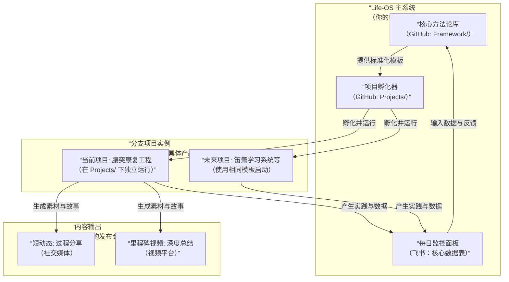

本计划遵循 **“主系统驱动，分支项目验证”** 的原则。**Life-OS 是你的“操作系统”和“工厂”，而腰突康复是第一个从该工厂生产出的“产品”。** 通过建造第一个产品，来迭代和完善工厂本身。

### 🗺️ 完整系统架构与执行总览

为了让整个系统的关系一目了然，下图展示了“Life-OS 主系统”、“分支项目”以及“内容输出”三大模块是如何协同运作的：

这个架构的核心在于：**你所有的具体行动（分支项目）都在为中央系统（Life-OS）提供数据和案例，而迭代后的中央系统又为未来的所有行动提供更优的模板和协议。** 所有环节都通过具体的工具承载。

---

### 📥 **第一阶段：系统奠基与项目启动（第 1-7 天）**

#### **🎯 核心目标**

1.  建立 Life-OS 中央工作区。
2.  启动“腰突康复工程”并完成首次记录。
3.  发布“立项宣言”，完成公开展示。

#### **📋 逐日执行清单**

| 天数          | 核心任务               | 具体操作与交付物                                                                                                                                                                                                                                                                                               |
| :------------ | :--------------------- | :------------------------------------------------------------------------------------------------------------------------------------------------------------------------------------------------------------------------------------------------------------------------------------------------------------- |
| **第 1 天**   | **建立“中央指挥部”**   | 1. **注册新账号**：在 B 站/视频号注册，命名如 `[你的名字]的Life-OS`。 2. **创建 GitHub 主仓库**：仓库名为 `yourname-Life-OS`。 3. **撰写总纲**：在`README.md`中，填写我们之前讨论的总纲内容。                                                                                                            |
| **第 2 天**   | **搭建“工厂车间”**     | 1. **创建文件夹**：在主仓库内创建 `Life-OS-Framework/` 和 `Projects/` 文件夹。 2. **创建核心模板**：在`Framework/`下创建 `00-项目启动协议模板.md`。内容围绕“目标、原则、数据指标、风险控制”展开。 3. **建立飞书仪表盘**：创建“每日核心数据”多维表格（包含日期、能量值、核心输入/输出、感悟）。           |
| **第 3 天**   | **启动第一个“产品线”** | 1. **创建子项目仓库**：在 GitHub 创建 `Rehabilitation-Project` 仓库，或在主仓库的`Projects/`下建立文件夹。 2. **生成项目协议**：使用昨天的模板，撰写 **《腰突康复工程开源协议 V1.0》**，包含你的个人基线、安全原则、训练协议、数据记录字段。 3. **开始记录**：在飞书，按照协议开始第一次训练并记录数据。 |
| **第 4-5 天** | **生产“产品发布会”**   | 1. **撰写视频脚本**：根据我们之前讨论的“立项宣言”框架撰写脚本。 2. **拍摄与剪辑**：拍摄你的第一个视频。风格需冷静、真诚、有逻辑。 3. **发布**：在新账号发布视频，标题参考 **《Life-OS 启动：一个程序员如何用开源项目思维，从零重构健康》**。**在简介中务必附上 GitHub 主仓库与康复项目仓库的链接。**     |
| **第 6 天**   | **建立复盘习惯**       | 1. **进行首次周复盘**：基于前几天的数据，在康复项目仓库或飞书写一段复盘。 2. **问 Life-OS 问题**：“项目启动流程顺畅吗？协议有什么需要立刻修改的？”并将思考更新到`Framework/`的模板中。                                                                                                                      |
| **第 7 天**   | **系统检查与规划**     | 1. **检查所有链接**：确保账号、视频、GitHub、飞书之间能顺畅跳转。 2. **规划下周内容**：确定下周要分享的一个“过程短动态”主题（例如：展示你的飞书数据记录界面）。                                                                                                                                             |

---

### 🔄 **第二阶段：系统化运行与输出（第 2-4 周及以后）**

此阶段进入稳定循环，所有动作均可复用。

#### **1. 每日/每周执行流程（循环）**

- **早晨（5 分钟）**：查看飞书“每日核心数据”表，规划今日核心输入（如：康复训练 30 分钟）。
- **执行中**：在康复项目专用的飞书表格中记录训练数据。
- **晚间（10 分钟）**：
  - 填写“每日核心数据”表。
  - **问一个 Life-OS 问题**（例如：“今天克服惰性的方法有效吗？能否加入动力协议？”），并将答案关键词记入飞书“闪念收集”文档。
- **每周日（30-60 分钟）**：
  1.  **项目层复盘**：回顾康复数据，写周报（发布至康复项目仓库的`Weekly-Review.md`）。
  2.  **系统层复盘**：整理“闪念收集”，将成型的思考更新到`Life-OS-Framework/`下的对应模板中。
  3.  **内容规划**：决定下周是否制作“里程碑视频”（建议每 2-4 周一次）。

#### **2. 内容发布节奏（复用模板）**

- **短动态（每周 1-2 次）**：展示一个**具体瞬间**（如：一个动作的技巧、一张数据图表）。模板：“【Life-OS·康复】发现：XXX，数据验证：XXX。”
- **里程碑视频（每 2-4 周 1 次）**：**固定结构**：1) 展示数据趋势；2) 分享一个核心发现/挫折；3) 宣布对《康复协议》的迭代（如 V1.1）；4) 感谢参与者。**这是你最重要的输出。**
- **协议迭代公告**：任何对《康复协议》的修改，都应在 GitHub 提交更新，并在动态或视频中说明。

#### **3. “工作主导模式”触发预案**

当有全职工作或外包时，**立即执行**：

1.  **时间分配**：个人系统时间自动压缩至每日**30 分钟**。
2.  **最低任务**：仅完成飞书数据记录和周复盘。
3.  **内容发布**：发布一条说明：“【系统公告】进入‘工作主导模式’，更新频率降低，核心维护持续。”然后只发最简单的数据截图动态，保持账号“活性”。

---

### ⚙️ **核心工具与文档清单（你的武器库）**

请将以下清单保存在你的飞书或笔记中，作为全局索引：

| 工具                   | 用途                       | 关键链接/位置                                  |
| :--------------------- | :------------------------- | :--------------------------------------------- |
| **GitHub 主仓库**      | Life-OS 系统总部、方法论库 | `https://github.com/yourname/yourname-Life-OS` |
| **GitHub 康复项目**    | 第一个分支项目所有文档     | 在主仓库的`Projects/`下或独立仓库              |
| **飞书“每日核心数据”** | 系统级每日监控仪表盘       | 飞书文档链接 1                                 |
| **飞书“康复训练日志”** | 项目级详细数据记录         | 飞书多维表格链接 2                             |
| **飞书“闪念收集”**     | 随时记录系统优化灵感       | 飞书文档链接 3                                 |
| **视频账号**           | 主内容输出与品牌阵地       | 你的新账号主页链接                             |

---

### 🎯 **现在，你的第一个动作**

**请在今天 24 小时内，完成“第一阶段”第 1 天的全部任务：**

1.  注册好你的**新内容平台账号**。
2.  创建你的 **`yourname-Life-OS`** GitHub 仓库。
3.  将本计划复制到该仓库的 `README.md` 或一个专用计划文档中。
