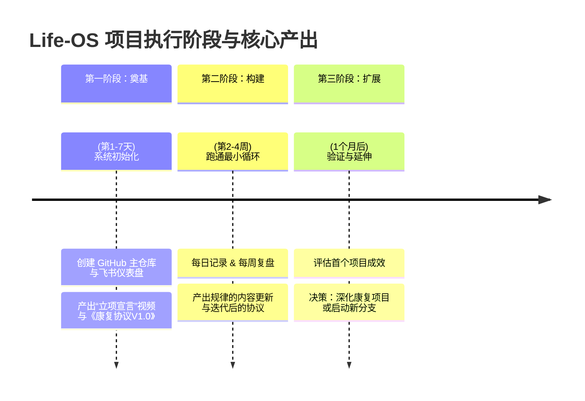

### 🧭 一、初衷与愿景：你为何而战？

**初衷（起点）**：
你最初的状态是 **“散点迷茫”** ——兴趣广泛（编程、笛箫、中医）、渴望自由职业但厌恶表演与约束、受困于腰突健康问题、在短视频探索中感到违背自我。核心矛盾是：**如何在不违背“随性、真实”本性的前提下，系统化地创造价值并获得自主权？**

**愿景（终点）**：
构建一个 **“以你为原型的可迭代系统”** 。它不仅是你的私人效率工具，更是一个公开的、可复用的**个人发展开源框架**。

1.  **对内**：成为你解决一切问题（健康、学习、工作）的**核心方法库**，让你稳定、从容地朝目标前进。
2.  **对外**：通过记录你真实的“构建过程”，吸引同频者，未来可能形成围绕该方法的**微社区或协作网络**，将你的时间价值产品化。

### ⚠️ 二、核心注意事项（防坑指南）

这是保证系统不偏离初衷、可持续运行的关键。

1.  **真实大于表演**：绝不为更新内容而扭曲行动。你的内容是“**系统调试日志**”，而非“成功学表演”。展示挫折与调试过程，比展示完美结果更有价值。
2.  **系统大于目标**：你的核心 KPI 不是“赚 X 钱”或“涨 X 粉”，而是 **“我的系统是否在持续、健康地运行与迭代”** 。稳定输出价值，机会自会寻来。
3.  **深度大于广度**：在第一个分支项目（腰突康复）被验证成功前，**严禁启动新项目**（笛箫软件、社区等想法必须先存入“灵感库”封存）。
4.  **安全大于一切**：涉及身体健康（如康复训练）的内容，必须前置专业咨询，并反复公开强调 **“非医疗建议”和“个人实验记录”** 的属性。
5.  **协议大于意志**：依赖预设的“系统协议”（如双模式切换、最低运行保障）来应对波动，而非依赖不可靠的意志力。

### 🗺️ 三、执行阶段与核心产出

你的行动将严格遵循以下三阶段，**严禁跳级**。

**各阶段核心动作与产出详解：**

**第一阶段：系统奠基与启动（第 1-7 天）**

- **核心动作**：
  1.  **建仓**：注册新账号；创建 GitHub 主仓库 (`yourname-Life-OS`)。
  2.  **立规**：在飞书/语雀建立“每日核心数据表”和“康复训练日志”。
  3.  **宣言**：拍摄发布 **“立项宣言”视频**，公开展示愿景与计划。
- **关键产出**：
  - **有形产出**：GitHub 仓库、飞书仪表盘、首个视频。
  - **无形产出**：公开承诺的心态、清晰的项目结构。

**第二阶段：系统化运行与输出（第 2-4 周及以后）**

- **核心动作（每日/每周循环）**：
  1.  **执行与记录**：按《康复协议》训练，并在飞书记录数据。
  2.  **复盘与提问**：每日/每周复盘，问 Life-OS 层面问题（例：“今天的执行流程顺畅吗？如何优化？”）。
  3.  **迭代与发布**：基于复盘更新协议；按节奏发布“过程短动态”和“里程碑视频”。
- **关键产出**：
  - **有形产出**：持续的数据日志、迭代的协议文档、系列视频内容、可能的初步协作记录。
  - **无形产出**：系统化工作的习惯、对自身规律的洞察、初始的观众信任。

**第三阶段：验证与延伸（1 个月后或首个里程碑达成后）**

- **核心动作**：
  1.  **深度复盘**：评估康复项目的成果与跑通的方法论。
  2.  **关键决策**：**二选一**：
      - **路径 A（深化）**：将康复项目推进到更高阶段，或启动“开源协作实验”。
      - **路径 B（拓展）**：用已验证的 Life-OS 框架，孵化第二个分支项目（如“笛箫学习系统”）。
- **关键产出**：
  - **有形产出**：一份经过实践验证的《Life-OS 框架白皮书》、第二个项目的基础设施。
  - **无形产出**：一套真正属于你、可迁移的“元能力”。

### 💎 总结与立即行动

**Life-OS 的本质，是将你“随性、真实、热爱解决问题”的特质，通过“工程化、系统化、开源化”的方式，变成你最强的竞争优势。**
